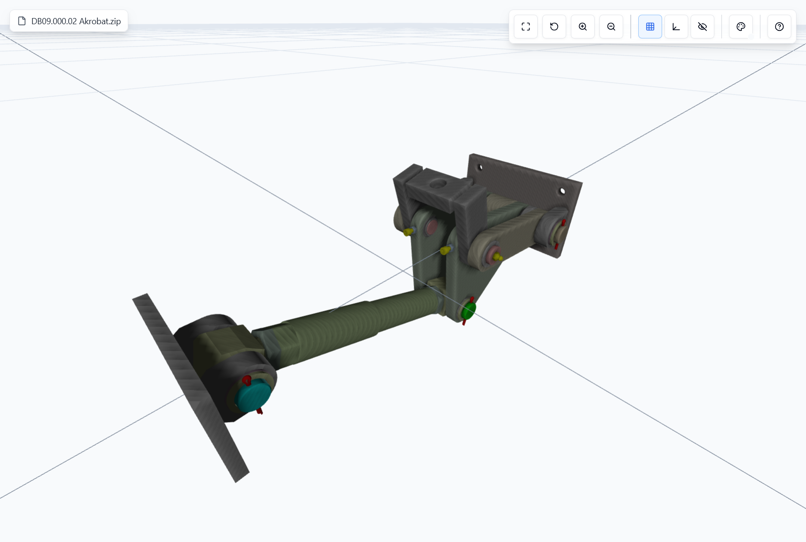
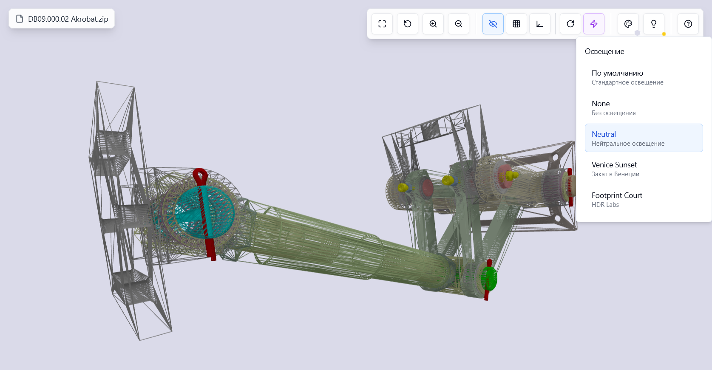
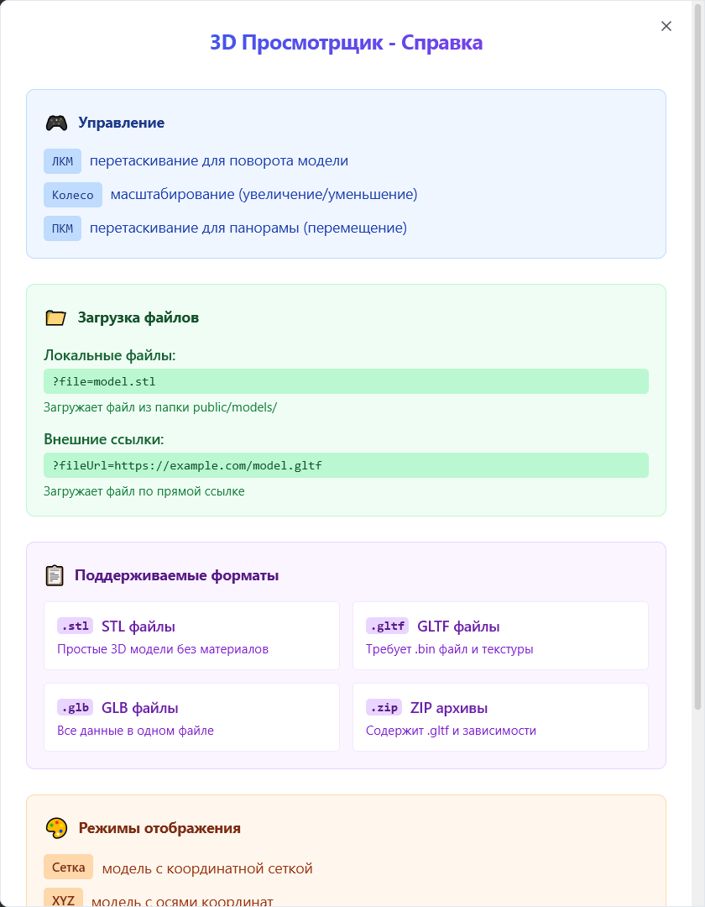

# 3D Model Viewer

A modern React-based 3D model viewer powered by Three.js, featuring comprehensive support for STL, GLTF, GLB, and ZIP formats. Built with advanced interactive controls, multiple display modes, dynamic lighting systems, and a responsive design.

## Screenshots



*Main interface showing a loaded 3D model with unified control panel and improved lighting.*



*Advanced display modes, wireframe view, and lighting controls.*


*Integrated background color picker with preset colors and custom selection.*



*Comprehensive help dialog with detailed usage instructions and feature explanations.*

## Features

### Core Functionality
- **Multi-format Support**: STL, GLTF, GLB, and ZIP archives containing GLTF models
- **Flexible Loading**: Load models via URL parameters (`?file=` for local files or `?fileUrl=` for remote URLs)
- **Smart Model Scaling**: Automatic scaling ensures models are properly visible on initial load
- **Error Handling**: Comprehensive error handling with user-friendly messages and loading states

### Interactive Controls
- **Advanced 3D Navigation**:
   - Unrestricted trackball rotation (360° in all directions)
   - Object-centered rotation for intuitive model manipulation
   - Zoom with mouse wheel or control buttons
   - Pan with right-click and drag
- **One-Click Actions**: Reset view, zoom in/out, and fullscreen toggle

### Display Modes
- **Clean Mode**: Model only with clean background (default)
- **Grid Mode**: 3D coordinate grid that rotates with the model
- **XYZ Axes**: Coordinate axes that follow model rotation
- **Wireframe Toggle**: Switch between solid and wireframe rendering
- **Auto-Rotation**: Continuous model rotation for presentations

### Advanced Lighting System
- **Default Lighting**: Standard Three.js lighting setup
- **No Lighting**: Pure ambient lighting for specific use cases
- **Neutral Lighting**: Balanced lighting for accurate color representation
- **Venice Sunset**: Warm, atmospheric HDR lighting
- **Footprint Court**: Professional HDR Labs lighting environment

### Customization Options
- **Background Colors**:
   - Integrated color picker with preset colors
   - Custom color selection with hex input
   - Persistent color preferences (saved to localStorage)
- **Visual Modes**: Toggle between solid, wireframe, and auto-rotating displays

### User Experience
- **Comprehensive Help**: Detailed in-app documentation with usage examples
- **Tooltips**: Contextual help for all controls
- **File Information**: Display current model filename and format
- **Fullscreen Support**: Distraction-free viewing mode

## Installation

1. Clone the repository:
   ```bash
   git clone https://github.com/cerobreath/3d-model-viewer.git
   cd 3d-model-viewer
   ```

2. Install dependencies:
   ```bash
   npm install
   ```

3. Start the development server:
   ```bash
   npm run dev
   ```

4. Build for production:
   ```bash
   npm run build
   ```

## Usage

### Loading Models

#### Local Files
Place your 3D models in the `public/models/` directory and access them using the `file` parameter:
```
http://localhost:5173/?file=model.stl
http://localhost:5173/?file=Vint_M8x65_ISO_7380.zip
```

#### Remote Files
Load models directly from external URLs using the `fileUrl` parameter:
```
http://localhost:5173/?fileUrl=https://example.com/model.gltf
http://localhost:5173/?fileUrl=https://example.com/model.glb
```

### Interactive Controls

#### Mouse Controls
- **Left Click + Drag**: Rotate model in 3D space (unrestricted trackball rotation)
- **Mouse Wheel**: Zoom in/out
- **Right Click + Drag**: Pan/move the model

#### Control Panel
- **Fullscreen Button**: Toggle fullscreen mode
- **Reset View**: Return to default camera position
- **Zoom In/Out**: Precise zoom controls
- **Display Mode Buttons**: Switch between clean, grid, and XYZ axes modes
- **Visual Controls**: Toggle wireframe, auto-rotation
- **Background Color**: Integrated color picker with presets
- **Lighting Controls**: Switch between different lighting environments
- **Help Button**: Access comprehensive documentation

### Supported File Formats

| Format | Description | Requirements |
|--------|-------------|--------------|
| **STL** | Standard Tessellation Language | Single file, no materials |
| **GLTF** | GL Transmission Format | Requires accompanying .bin files and textures |
| **GLB** | Binary GLTF | Self-contained, includes all resources |
| **ZIP** | Compressed Archive | Must contain .gltf file and dependencies |

### Lighting Presets

- **Default**: Standard Three.js lighting with ambient and directional lights
- **None**: Pure ambient lighting for flat rendering
- **Neutral**: Balanced lighting for accurate color representation
- **Venice Sunset**: Warm HDR environment with sunset ambiance
- **Footprint Court**: Professional HDR Labs lighting setup

## Technical Details

### Dependencies
- **React 18+**: Modern React with hooks and concurrent features
- **Three.js**: 3D graphics library with STL and GLTF loaders
- **JSZip**: ZIP file extraction for compressed models
- **Lucide React**: Modern icon library
- **Shadcn/UI**: Component library (Alert, Button, Dialog, Popover, Toast)
- **TanStack Query**: Data fetching and caching
- **Tailwind CSS**: Utility-first CSS framework

## Contributing

1. Fork the repository
2. Create a feature branch: `git checkout -b feature/amazing-feature`
3. Commit changes: `git commit -m 'Add amazing feature'`
4. Push to branch: `git push origin feature/amazing-feature`
5. Open a Pull Request

## License

MIT License - see [LICENSE](LICENSE) file for details.