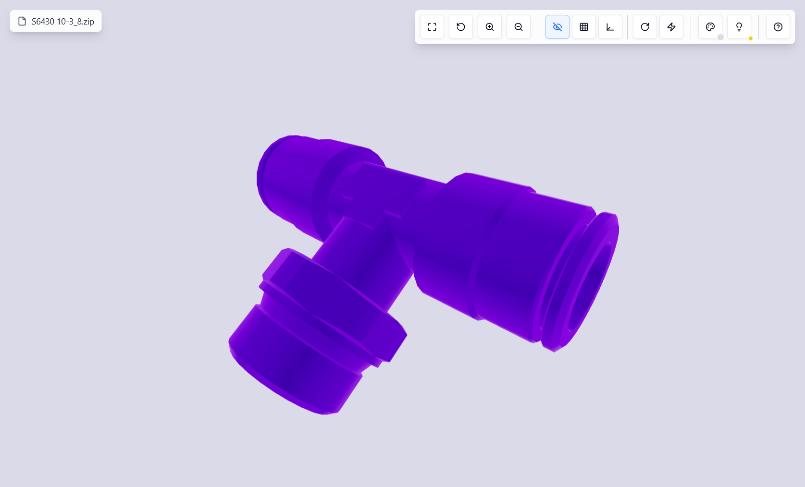
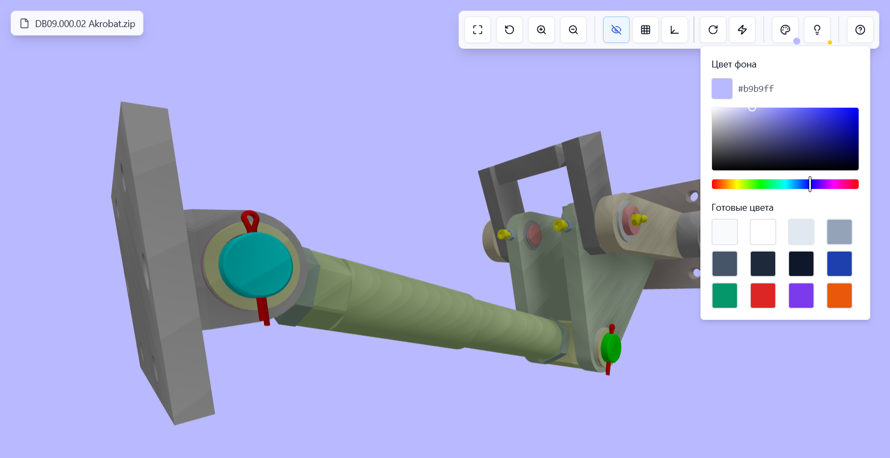
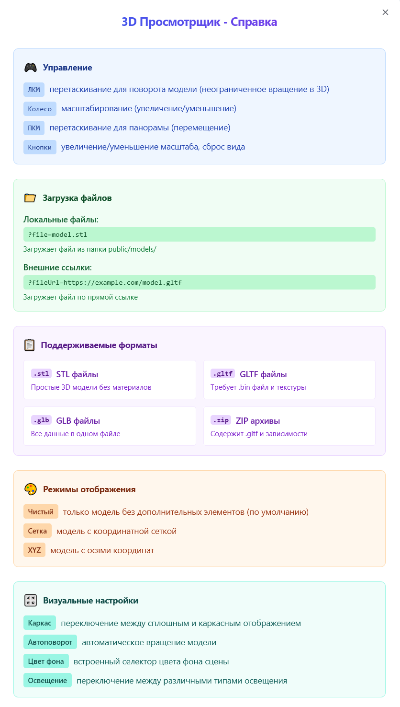

# 3D Model Viewer

A React-based 3D model viewer using Three.js, supporting STL, GLTF, GLB, and ZIP (containing GLTF) files. Features interactive controls, display modes, background color customization, and responsive design.

## Screenshots

*Main interface showing a loaded 3D model with control panel.*


*Background color picker with preset and custom options.*


*Help dialog with usage instructions.*

## Features
- Load models via URL parameters (`?file=` or `?fileUrl=`).
- Supported formats: STL, GLTF, GLB, ZIP (with GLTF and dependencies).
- Controls: rotate (LMB), zoom (mouse wheel/buttons), pan (RMB).
- Display modes: grid, XYZ axes, clean background.
- Background color picker with presets (saved in localStorage).
- Fullscreen mode.
- Help dialog with usage instructions.
- Responsive UI with error handling and loading states.
- Tooltips and toast notifications for better UX.

## Installation

1. Clone the repository:
   ```bash
   git clone https://github.com/your-username/3d-model-viewer.git
   cd 3d-model-viewer
   ```

2. Install dependencies:
   ```bash
   npm install
   ```

3. Start the development server:
   ```bash
   npm run dev
   ```

## Usage

### Loading Models
- **Local Files**: Place models in `public/models/` and access via `?file=model.stl` (e.g., `http://localhost:5173/?file=model.stl`).
- **Remote Files**: Use `?fileUrl=` for direct URLs (e.g., `http://localhost:5173/?fileUrl=https://example.com/model.gltf`).
- **ZIP Archives**: Ensure ZIP contains a `.gltf` file and dependencies (e.g., `.bin`, textures).

### Example URLs
- Local STL: `http://localhost:5173/?file=model.stl`
- Remote GLTF: `http://localhost:5173/?fileUrl=https://example.com/model.gltf`
- ZIP with GLTF: `http://localhost:5173/?fileUrl=https://example.com/model.zip`

### Controls
- **Rotate**: Left-click and drag.
- **Zoom**: Mouse wheel or zoom buttons.
- **Pan**: Right-click and drag.
- **Reset View**: Reset button to restore default view.
- **Fullscreen**: Toggle fullscreen mode.
- **Display Modes**: Switch between grid, XYZ axes, or clean background via buttons.
- **Background Color**: Adjust via color picker with preset colors (persists across sessions).

### Supported Formats
- **STL**: Simple 3D models (no materials/textures).
- **GLTF**: Requires `.bin` and textures in the same directory.
- **GLB**: Self-contained, single file.
- **ZIP**: Must include `.gltf` and dependencies.

## Project Structure
- `App.tsx`: Entry point with QueryClient and UI providers (Toaster, Tooltip).
- `Index.tsx`: Main component for model loading and UI orchestration.
- `3DViewer.tsx`: Three.js rendering component for 3D models.
- `ControlPanel.tsx`: UI controls for fullscreen, zoom, reset, display modes, and color picker.
- `BackgroundColorPicker.tsx`: Color selection with presets and custom input.
- `DisplayModeControls.tsx`: Buttons for toggling grid, axes, or clean display modes.
- `HelpDialog.tsx`: Dialog with usage instructions.

## Dependencies
- React
- Three.js (`three`, `STLLoader`, `GLTFLoader`, `OrbitControls`)
- JSZip (for ZIP handling)
- Lucide-React (icons)
- Shadcn/UI (`Alert`, `Button`, `Dialog`, `Popover`, `Sonner`, `Tooltip`, `Toast`, `Toaster`)
- Tanstack Query (`@tanstack/react-query`)

## Development Notes
- Place local models in `public/models/` for `?file=` loading.
- Ensure remote URLs are CORS-enabled for `?fileUrl=`.
- Test with various model formats for compatibility.
- Add screenshots to `screenshots/` folder for README.
- Use `npm run build` for production builds.

## Contributing
1. Fork the repository.
2. Create a feature branch (`git checkout -b feature/your-feature`).
3. Commit changes (`git commit -m 'Add your feature'`).
4. Push to the branch (`git push origin feature/your-feature`).
5. Open a pull request.

## License
MIT License. See [LICENSE](LICENSE) for details.